# e-commerce-2.0
Este proyecto es un e-commerce, donde se puede ver los productos y buscar los que desemos en tiempo real, ordenarlos por precio o por
categoria, añadirlos al carrito o a nuestra lista de deseos y comentar sobre cualquier producto. 
Cuenta con una vista de admin, donde se pueden buscar los productos existentes, editarlos, borrarlos, o crear uno nuevo.
Así mismo, cuenta con guards que protegen la página de manera que si no estas conectad@ no puedes acceder a ciertas vistas de TecnoShop.
Además tenemos nuestro propio perfil donde podemos ver nuestros datos, nuestros pedidos y nuestra lista de deseos.
También cuenta con un formulario de contacto donde se puede contactar con atención al cliente, y una vista de "about" donde se habla un 
poco a cerca de TecnoShop.

## Tecnologías que he utilizado 🛠️

>Mi proyecto esta creado con Angular en el frontend y Bulma como framework de css. Y con PHP Laravel en el backend y MySQL como base de
datos.

#### Preview
Vista de home:

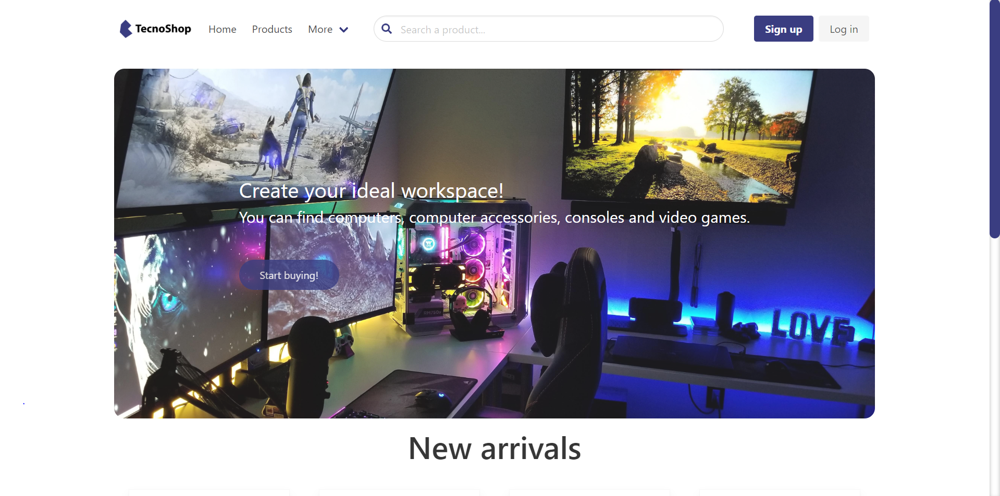 

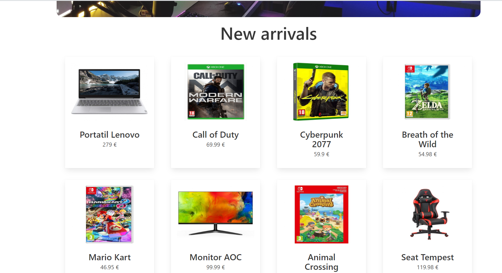 

Vista products:

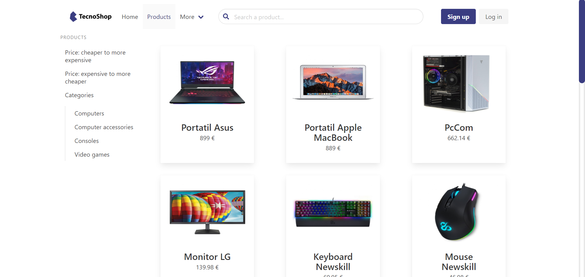 

Aquí puedes buscar productos en tiempo real y filtar por precio o por categoria.

 
 
 En el detalle del producto, podemos ver su información mas detallada, añadirlo al carrito o a nuestra lista de deseos  y comentar.
 
  
 
 Aquí accedemos al carrito donde podemos seleccionar la cantidad deseada, eliminar el producto que no queremos y finalizar la compra.
 
 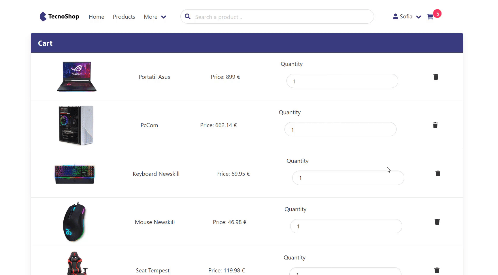 
 
TecnoShop también cuenta con la vista de Admin a la cual solo puedes acceder si tienes el role de admin.

 En nuestra vista de admin podemos buscar los diferentes productos, además de contar con una páginación.
 
 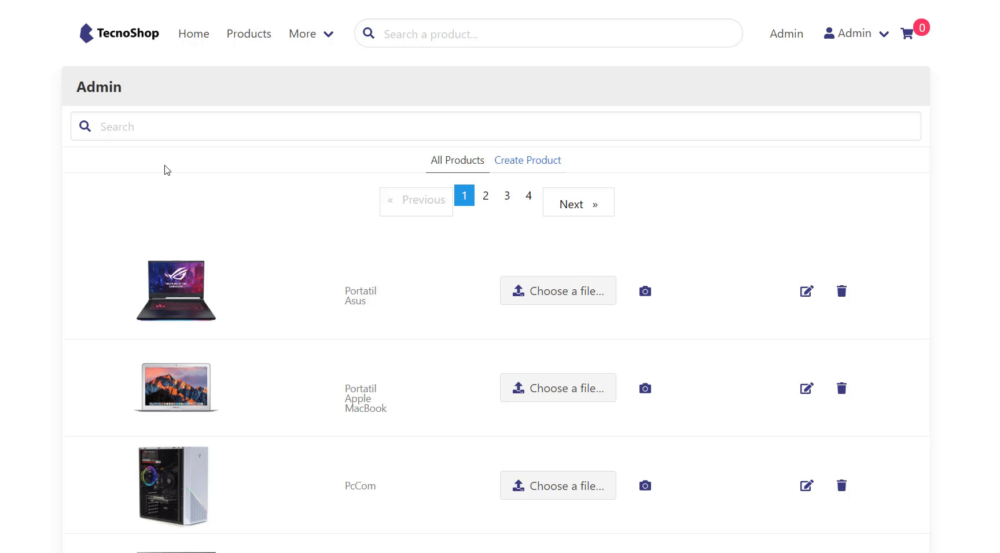 
 
Además podemos crear, editar y borrar productos:

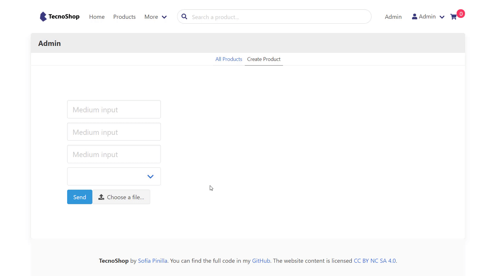 

 


Vista del perfil donde podemos encontrar nuestros pedidos y nuestros productos en la lista de deseos:

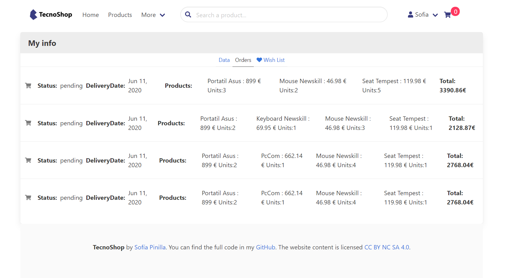 

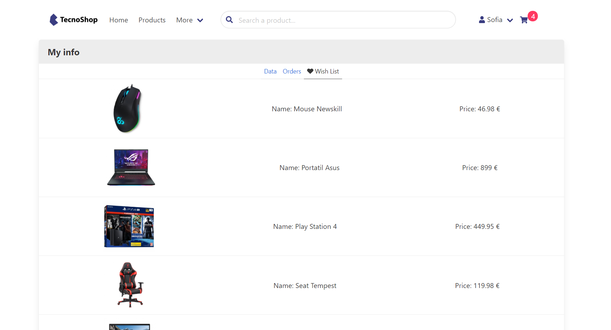 

Página 404:

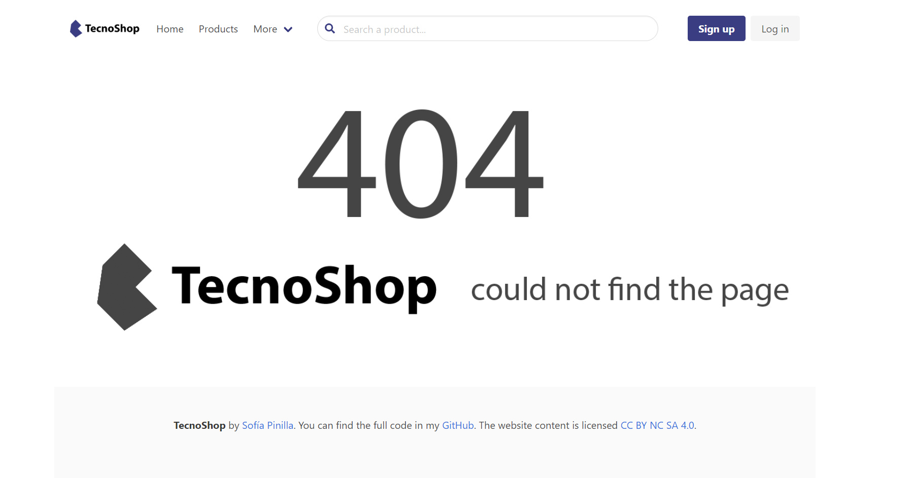 

Vista de contacto:
 

Vista de about:
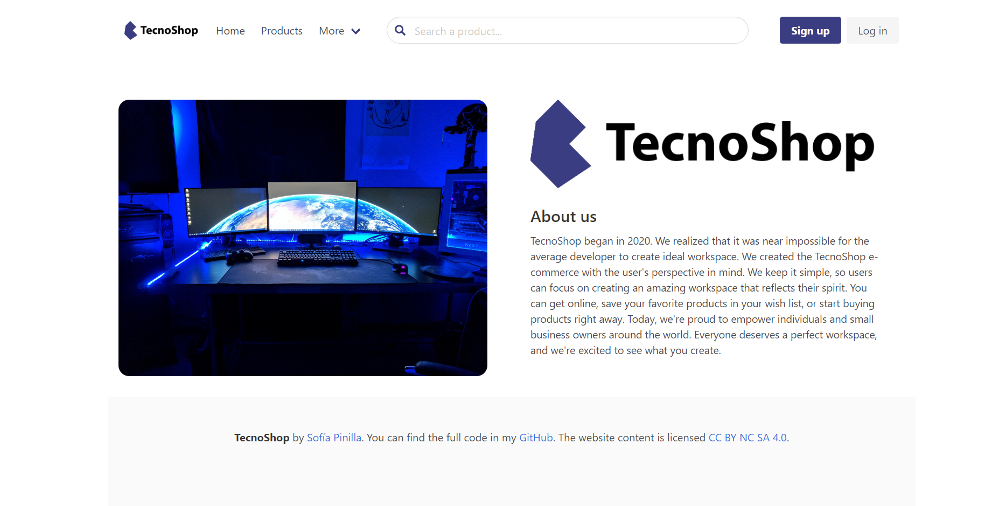 

Vista de registro:
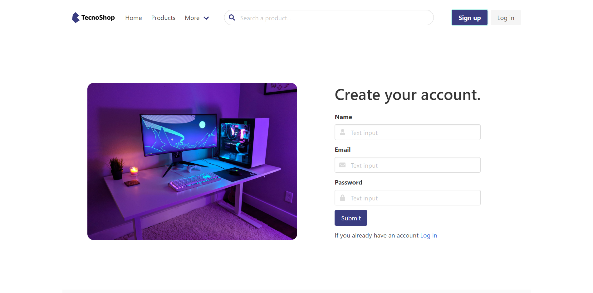

Vista de login:
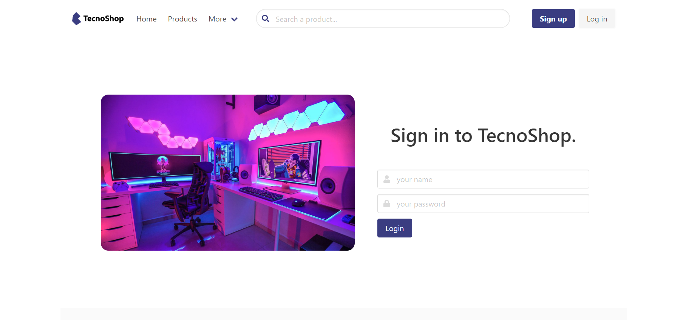 

Guards:
 

### Pre-requisitos 📋

Para que la aplicación funciona debes tener instalado Angular y PHP Laravel.

```
npm install -g @angular/cli
```
Para poder utilizar Laravel debes tener composer instalada si aún no lo tienes lo puedes descargar [aquí](https://getcomposer.org/download/)
```
composer global require "laravel/installer"
```

### Instalación 🔧

Para poder iniciar el proyecto primero haz un clone:

```
git clone https://github.com/SofiaPinilla/e-commerce-2.0.git
```
Una vez clonado el proyecto, debes instalar los modulos necesarios con npm:

```
cd frontend y npm install y cd backend y npm install
```

Ya esta listo el proyecto, ahora para iniciarlo situate en la carpeta inicial:
```
npm start
```


---
Hecho por [Sofía Pinilla](https://github.com/SofiaPinilla) 😊
